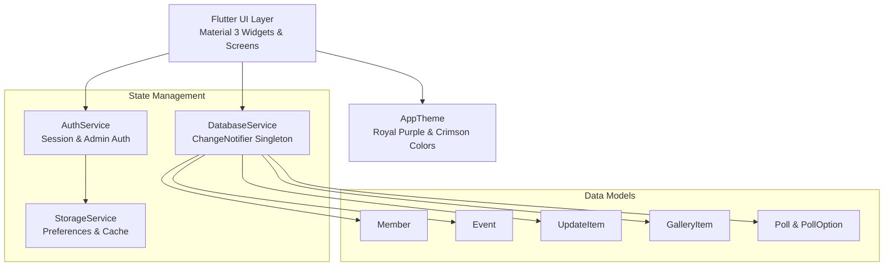

# Nikhil's Association ❤️ — Official Fan Engagement & Community Mobile Application

[](https://flutter.dev)
[](https://dart.dev)
[](https://m3.material.io)
[](https://flutter.dev/multi-platform)
[](LICENSE)

An official, cross-platform community application built using **Flutter & Material 3** for **Nikhil's Fan Association**. The application bridges the gap between the association leadership and thousands of devoted fans across multiple cities and districts, providing real-time event updates, digital membership ID cards, interactive fan walls, opinion polls, media galleries, and an administrative control center.

---

## 📑 Table of Contents

- [Key Highlights](#-key-highlights)
- [Application Screenshots & UI Overview](#-application-screenshots--ui-overview)
- [Feature Modules](#-feature-modules)
  - [1. Home Hub](#1-home-hub)
  - [2. Updates & Announcements](#2-updates--announcements)
  - [3. Events & Conventions Tracker](#3-events--conventions-tracker)
  - [4. Media Gallery & Photo Stream](#4-media-gallery--photo-stream)
  - [5. Fans Community & Live Fan Wall](#5-fans-community--live-fan-wall)
  - [6. Digital Membership & Profile](#6-digital-membership--profile)
  - [7. Executive Leadership Directory](#7-executive-leadership-directory)
  - [8. Administrative Management Portal](#8-administrative-management-portal)
- [Architecture & Tech Stack](#-architecture--tech-stack)
- [Directory Structure](#-directory-structure)
- [Getting Started](#-getting-started)
  - [Prerequisites](#prerequisites)
  - [Installation & Execution](#installation--execution)
- [Pre-configured Credentials](#-pre-configured-credentials)
- [Testing](#-testing)
- [Contributing](#-contributing)
- [License](#-license)

---

## 🌟 Key Highlights

* **Material 3 Modern Aesthetics:** Built on a custom royal purple (`#673AB7`) and crimson heart (`#E91E63`) design system with card elevation, fluid bottom navigation, and micro-animations.
* **Instant Digital ID Generation:** Generates tamper-resistant digital member ID cards (`SKR-2026-XXXX`) with tier badges (Gold Fan, Platinum VIP, Youth Wing Leader) and blood group tags for emergency drives.
* **Community Fan Wall & Live Polls:** Interactive social feed with immediate reaction likes, city filtering, and real-time voting progress bars.
* **Full-Screen Interactive Media Gallery:** High-resolution photo stream with pan, pinch-to-zoom (`InteractiveViewer`), and share shortcuts.
* **Reactive Singleton State:** Driven by `DatabaseService` utilizing `ChangeNotifier` and `ListenableBuilder` for zero-lag UI updates across all tabs.
* **Secret Admin Control Center:** Multi-module dashboard allowing authorized coordinators to moderate posts, publish announcements, schedule events, add polls, and broadcast notifications.

---

## 📱 Application Screenshots & UI Overview

```
┌────────────────────────────────┐  ┌────────────────────────────────┐  ┌────────────────────────────────┐
│      Nikhil's Association ❤️   │  │        Updates & News 📰       │  │        Fans Community 💬        │
│  [Verified Official Badge]     │  │  [🔍 Search announcements...]  │  │  [Community]    [Leadership]   │
│                                │  │                                │  │                                │
│ ┌─────┐  ┌─────┐  ┌─────┐      │  │ [All] [Announcements] [News]   │  │ 📊 Active Polls:               │
│ │2,450│  │ 36+ │  │1,200│      │  │                                │  │ Next Fan Meet 2027 City?       │
│ │Fans │  │Meet │  │Photo│      │  │ 📌 Grand State Meet 2026       │  │ [====== 64% Hyderabad  ]       │
│ └─────┘  └─────┘  └─────┘      │  │ Official schedule for state    │  │                                │
│                                │  │ convention and charity drive   │  │ ❤️ Fan Wall Feed:              │
│ 📢 Pinned Announcement         │  │                                │  │ Ramesh Reddy (Hyderabad)       │
│ Nikhil's Grand State Meet      │  │ 🎟️ Fan Meet Passes Released    │  │ "Proud to be part of Nikhil's  │
│                                │  │ Registration passes live now!  │  │  Association! Long live! 🔥"   │
│ 🎟️ Upcoming: Fan Meet 2026    │  │                                │  │                                │
│ Shilpakala Vedika • Oct 18     │  │ 🩸 Blood Donation Camp         │  │ ┌────────────────────────────┐ │
│ [ RSVP / Register Now ]        │  │ Collected 150+ blood units     │  │ │ ✍️ Post on Fan Wall       │ │
│                                │  │                                │  │ └────────────────────────────┘ │
│ [Home] [News] [Gallery] [Fans] │  │ [Home] [News] [Gallery] [Fans] │  │ [Home] [News] [Gallery] [Fans] │
└────────────────────────────────┘  └────────────────────────────────┘  └────────────────────────────────┘
```

---

## 🚀 Feature Modules

### 1. Home Hub
* **Association Header:** Official verified badge, association logo typography, and quick admin portal launcher.
* **Live Community Stats:** Quick-glance stat counter cards displaying total active members, events organized, and gallery photos.
* **Featured Announcements & Event Banner:** Highlighting urgent updates and upcoming fan meets with remaining seat counts.
* **Quick Access Navigation:** 1-tap shortcuts to Updates, Gallery, Fan Wall, Leadership Team, and Digital ID.

### 2. Updates & Announcements
* **Real-Time Search Bar:** Instantly filter announcements and circulars by keywords, headlines, or dates.
* **Categorized Feeds:** Filter through `Announcements`, `News`, and `Association activities`.
* **Pinned Priority:** High-priority notices remain permanently anchored at the top with badges and timestamp markers.

### 3. Events & Conventions Tracker
* **Interactive Event Cards:** Browse upcoming city meets, charity outreach drives, and foundation birthday rallies.
* **Event Modals:** Deep dive into timings, venue coordinates, registered attendee tallies, and program itineraries.
* **1-Tap RSVP Registration:** Toggle event registration status in real time with dynamic badge counter updates.

### 4. Media Gallery & Photo Stream
* **Categorized Photo Streams:** Filter by `Fan meets`, `Events`, and `Photos`.
* **Pinch-to-Zoom Viewer:** Full-screen modal utilizing Flutter's `InteractiveViewer` with smooth pan, zoom (up to 4x), and native share hooks.
* **Community Appreciation:** Like counter with animated heart reactions for every uploaded photo.

### 5. Fans Community & Live Fan Wall
* **Live Opinion Polls:** Democratic voting on fan club initiatives (e.g., host cities for upcoming meets, priority social welfare campaigns) with animated vote bars.
* **Digital Fan Wall:** Interactive message board where fans share greetings, city updates, and rally photos.
* **New Post Modal:** Clean bottom-sheet modal allowing registered members to publish fan wall posts with city tags.

### 6. Digital Membership & Profile
* **Digital Member ID Card:** Sleek official membership card featuring:
  * Member Name & Profile Avatar
  * Unique ID: `SKR-2026-XXXX`
  * Membership Tier: `President / Founder`, `Platinum VIP`, `Gold Fan`, `Youth Wing Leader`
  * Emergency Blood Group tag (`O+`, `B+`, `A+`, etc.)
  * Issue date and association watermark
* **Member Registration Form:** Self-registration form with phone number validation and automated ID allocation.
* **Profile Management:** Edit profile modal to update contact details, district, and personal information.

### 7. Executive Leadership Directory
* **Leadership Roster:** Transparent organizational structure featuring the President, General Secretary, Treasurer, Manager, and District Coordinators.
* **Direct Contact & Verification:** View contact phone numbers, roles, and executive credentials.

### 8. Administrative Management Portal
Access via the top-right shield button on the Home screen or Profile tab using authorized credentials (`admin` / `admin123`). The control center includes **8 dedicated management tabs**:

| Section | Management Capability |
| :--- | :--- |
| **👥 Members** | View all registered members, search by name/city, inspect membership IDs, and remove inactive accounts |
| **📰 Updates** | Draft and publish new announcements, toggle pinned status, attach banner URLs, and delete circulars |
| **🖼️ Gallery** | Add new gallery items with categories (`Fan meets`, `Events`, `Photos`), titles, and image links |
| **📅 Events** | Schedule new fan meets, specify venues, dates, timings, and monitor live attendee counts |
| **💬 Fan Posts** | Moderate the community fan wall and delete spam or inappropriate posts |
| **📊 Polls** | Create new live opinion polls with custom multiple-choice options and expiry dates |
| **👔 Leadership** | Manage executive committee listings, designations, photos, and contact phone numbers |
| **🔔 Notifications** | Compose broadcast alerts and push notifications delivered to all registered member devices |

---

## 🛠️ Architecture & Tech Stack



* **Framework:** [Flutter](https://flutter.dev) (v3.13.4+)
* **Language:** [Dart](https://dart.dev) (v3.x)
* **Design Standards:** Google Material Design 3 (`useMaterial3: true`)
* **Icons:** Material Icons & Cupertino Icons
* **State Management:** Reactive `ChangeNotifier` singleton pattern with `ListenableBuilder`
* **Target Platforms:** Android (APK/AAB), iOS (IPA), Web (HTML5/CanvasKit), Windows, macOS, Linux

---

## 📂 Directory Structure

```text
fan_page/
├── android/                   # Native Android container & Gradle build scripts
├── ios/                       # Native iOS container & Xcode project
├── web/                       # Web container (index.html, manifest, icons)
├── windows/                   # Windows desktop runner & resources
├── macos/                     # macOS desktop runner
├── linux/                     # Linux desktop CMake configuration
├── test/                      # Unit & widget tests
│   └── widget_test.dart
├── lib/
│   ├── main.dart              # Application entry point & root router
│   ├── theme/
│   │   └── app_theme.dart     # Material 3 colors, typography & card styles
│   ├── models/                # Data models
│   │   ├── member.dart        # Member & ID card data model
│   │   ├── event.dart         # Event schedule & RSVP data model
│   │   ├── update.dart        # Announcements & news feed model
│   │   ├── gallery_item.dart  # Media gallery item model
│   │   └── poll.dart          # Community opinion poll model
│   ├── services/              # Core application services
│   │   ├── database_service.dart # Reactive data store & CRUD operations
│   │   ├── auth_service.dart     # Authentication & admin session store
│   │   └── storage_service.dart  # Local cache & mock persistence
│   ├── widgets/               # Reusable modular UI components
│   │   ├── stat_card.dart        # Metric counter cards
│   │   ├── announcement_card.dart# Pinned & normal announcement card
│   │   ├── event_card.dart       # Event item card with RSVP action
│   │   ├── gallery_card.dart     # Image card with like animation
│   │   └── leadership_card.dart  # Committee member profile card
│   └── screens/               # Application views
│       ├── home_screen.dart       # Main home dashboard
│       ├── updates_screen.dart    # Announcements & circulars
│       ├── events_screen.dart     # Fan meets & charity events
│       ├── gallery_screen.dart    # Photo stream & full-screen viewer
│       ├── fans_screen.dart       # Fan wall & opinion polls
│       ├── membership_screen.dart # Digital ID registration & card
│       ├── leadership_screen.dart # Committee leadership roster
│       ├── profile_screen.dart    # User profile & credentials
│       └── admin/
│           └── admin_dashboard.dart # 8-module administrative dashboard
├── pubspec.yaml               # Project dependencies and asset definitions
└── README.md                  # Project documentation
```

---

## 💻 Getting Started

### Prerequisites

Ensure you have the following installed on your machine:
* [Flutter SDK](https://docs.flutter.dev/get-started/install) (`>= 3.13.4`)
* [Dart SDK](https://dart.dev/get-dart) (`>= 3.0.0`)
* Android Studio / Xcode / VS Code with Flutter Extension
* An Android emulator, iOS simulator, or connected physical device

### Installation & Execution

1. **Clone the repository:**
   ```bash
   git clone https://github.com/sriram-kavadi/fan_page.git
   cd fan_page
   ```

2. **Fetch dependencies:**
   ```bash
   flutter pub get
   ```

3. **Verify Flutter setup:**
   ```bash
   flutter doctor
   ```

4. **Run the application:**
   * **Chrome (Web):**
     ```bash
     flutter run -d chrome
     ```
   * **Android Device / Emulator:**
     ```bash
     flutter run -d android
     ```
   * **Windows Desktop:**
     ```bash
     flutter run -d windows
     ```
   * **iOS Simulator (macOS only):**
     ```bash
     flutter run -d ios
     ```

5. **Build Release APK (Android):**
   ```bash
   flutter build apk --release
   ```
   *The generated APK will be available at `build/app/outputs/flutter-apk/app-release.apk`.*

---

## 🔐 Pre-configured Credentials

To access the administrative management features, click the **Shield Icon** in the top-right corner of the Home screen or visit the Admin Portal button in the Profile tab:

| Role | Username | Password | Access Level |
| :--- | :--- | :--- | :--- |
| **Association Admin / Coordinator** | `admin` | `admin123` | Full administrative access to all 8 dashboard modules |
| **Standard Member / Fan** | *Auto-authenticated* | *N/A* | Browse, RSVP events, vote on polls, post on fan wall, register ID card |

---

## 🧪 Testing

Run automated widget and unit tests with:

```bash
flutter test
```

---

## 🤝 Contributing

Contributions are warmly welcomed! To contribute:

1. Fork the Project
2. Create your Feature Branch (`git checkout -b feature/AmazingFeature`)
3. Commit your Changes (`git commit -m 'feat: Add AmazingFeature'`)
4. Push to the Branch (`git push origin feature/AmazingFeature`)
5. Open a Pull Request

---

## 📄 License

This project is open-source and distributed under the [MIT License](LICENSE).

---

<p align="center">
  <b>Built with ❤️ for Nikhil's Fan Association</b><br/>
  <i>Connecting fans, celebrating unity, and powering community welfare.</i>
</p>